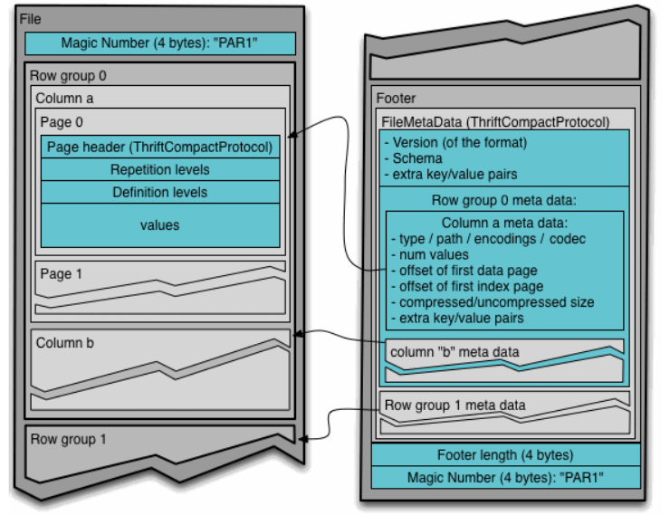
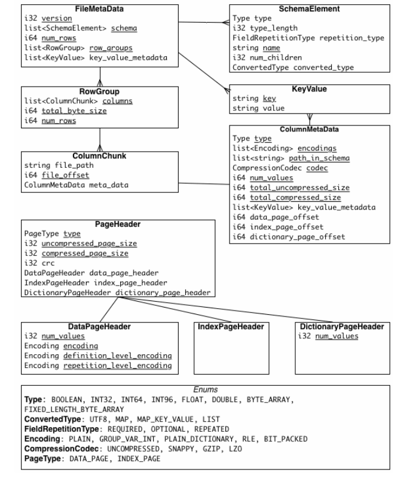

# Parquet
## What is Parquet
> Apache Parquet is a columnar storage format available to any project in the Hadoop ecosystem, 
> regardless of the choice of data processing framework, data model or programming language.

[Apache Parquet](https://parquet.apache.org)是Hadoop生态系统中任何项目均可使用的列式存储格式，而与数据处理框架，数据模型或编程语言的选择无关。

提出Parquet是为了让Hadoop生态的项目可以更好的使用压缩的，高效的列式数据表示形式。

Parquet考虑了复杂的嵌套数据结构，并且使用了记录粉碎和组装算法。Parquet认为这种方法优于简单扁平的命名空间的嵌套。

Parquet允许在每个列的级别上制定压缩方案。
## Glossary
* Block 代表HDFS的文件块
* File  包含文件元信息的文件，没有必要包含数据
* Row group 一种将数据逻辑水平划分成行的方式。由数据集每个Column的Column Chunk组成
* Column chunk 特定列的数据块，在文件当中是连续的
* Page 列块划分成的不可分割单元，列块可以有交错的多种页面类型

一个File由一个或者多个RowGroup组成，RowGroup每列仅包含一个Column Chunk。Column Chunk包含一个或者多个page。

##MetaData
三种类型的元数据
### File MetaData
### Column MetaData
### PageHeader MetaData

